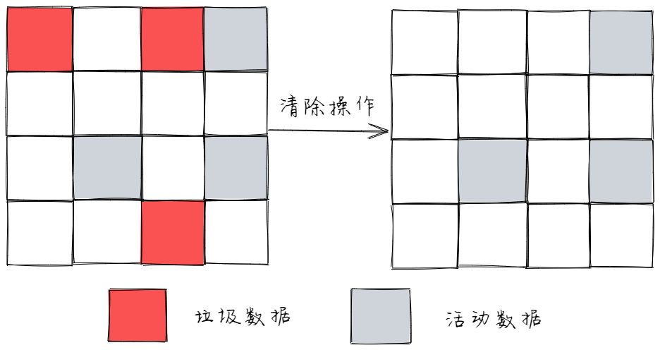

# 内存管理

> 当一个新的个体参与到应用的运行中来，我们首先需要给这个个体分配一份内存空间。而这个个体参与结束之后，它不再参与应用的运行了，我们就应该想办法让它把刚才所占的内存空间让出来，释放掉，这样才能有效的利用有限的内存空间。这个过程，就是内存管理。

  
```javascript {.line-numbers}
  // 1. 给新的个体分配内存空间
  var a = 20;
  // 2. 参与程序运行，使用空间
  alert(a + 20);
  // 3. 参与完毕，释放内存
  a = null;
```


## javascript垃圾回收

### javascript 中的垃圾

- javascript 中的内存管理是自动的；
- 对象不再被引用的时候就是垃圾；
- 对象不能从跟上访问到时就是垃圾；

### javascript 中的可达对象

- 可以访问到的对象就是可达对象（引用、作用域链）；
- 可达的标准就是从根出发能够被找到；
- javascript 中的根可以理解为全局对象

```javascript 
let obj = {name: 'TOM'};
let ali = obj;
obj = null;
```

```javascript {.line-numbers}
 function objGroup(obj1, ob2) {

   obj1.next = obj2;
   obj2.pre = obj1;

   return {
     o1: obj1,
     o2: obj2
   }
 }

 objGroup({name: 'xiaoming'}, {name: 'xiaohua'})
```


## GC 算法的介绍
- GC 是一种机制，垃圾回收器完成具体工作；
- 工作的内容就是查找垃圾释放空间、回收空间；
- 算法就是工作是查找和回收所遵循的规则；

### 常见的GC算法
- 引用计数
- 标记清除
- 标记整理
- 分代回收

#### 引用计数算法
- 核心思想：设置引用计数，判断当前引用数是否为0；
- 引用计数器；
- 引用关系发生改变时修改引用的数字；
- 引用数字为0的时候立即回收；

##### 1、引用算法的优点 
- 发现垃圾立即回收；
- 最大限度减少程序暂停；

##### 2、引用算法的缺点
- 无法回收循环引用的对象；
- 时间开销大；

```javascript
  function fn() {
    const obj1 = {}
    const obj2 = {}

    obj1.name = obj2
    obj2.name = obj1
    return ''
  }
  fn()

```

#### 标记清除算法

- 核心思想： 分标记和清楚两个阶段完成；
- 遍历所有对象找标记活动对象；
- 遍历所有对象清除没有标记的对象；
- 回收相应的空间；



##### 1、标记清除算法的优点

- 可以解决循环引用的问题；

##### 2、标记清除算法的缺点

- 造成空间碎片化空间，浪费空间；
- 不会立即回收垃圾对象；

#### 标记整理算法

- 标记整理可以看成是标记清除的增强；
- 标记阶段的操作和标记清除一致；
- 清除阶段会先执行整理，移动对象的位置；


##### 1、标记整理算法的优点
- 减少碎片化空间

##### 2、标记整理算法的缺点
- 不会立即回收垃圾对象


### V8

- v8是一款主流的javascript执行的引擎；
- v8采用即时编译；
- v8内存设限（64位1.5G， 32位800M）；

#### 1、v8垃圾回收策略

- 采用分代回收思想；
- 内存分为新生代和老生代；
- 针对不同的对象采用不同的算法；

#### 2、v8中常用几GC算法

- 分代回收
- 空间复制
- 标记清除
- 标记整理
- 标记增量

#### 3、v8 内存分配


 

- v8内存空间一分为二（新生代 | 老生代）；
- 小空间由于存储新生代对象（32M | 16M）；
- 新生代对象是指存活时间较短的对象

#### 4、新生代对象的回收实现

- 回收过程采用复制算法 + 标记整理；
- 新生代内存区分为二个等大小的空间（From | To）;
- 使用空间From， 空闲空间To；
- 活动对象存储于From空间；
- 将活动对象从Form拷贝到To； 
- From与To交换空间完成释放；

> 回收细节说明:
>- 拷贝过程中可能出现晋升；
>- 晋升就是将新生代对象移动至老生代对象；
>- 一轮GC还存活的新生代对象需要晋升；
>- To空间的使用率超过25%；

#### 6、老生代对象的回收实现

- 存在于右侧的老生代区域；
- 64位操作系统是1.4G，32位操作系统是700M；
- 老生代对象是指存活时间比较长的对象；

#### 7、老生代对象的回收实现

- 主要采用标记清除、标记整理、增量标记算法；
- 首先使用标记清除完成垃圾空间回收；
- 采用标记整理进行空间优化；
- 采用增量标记进行效率优化；


